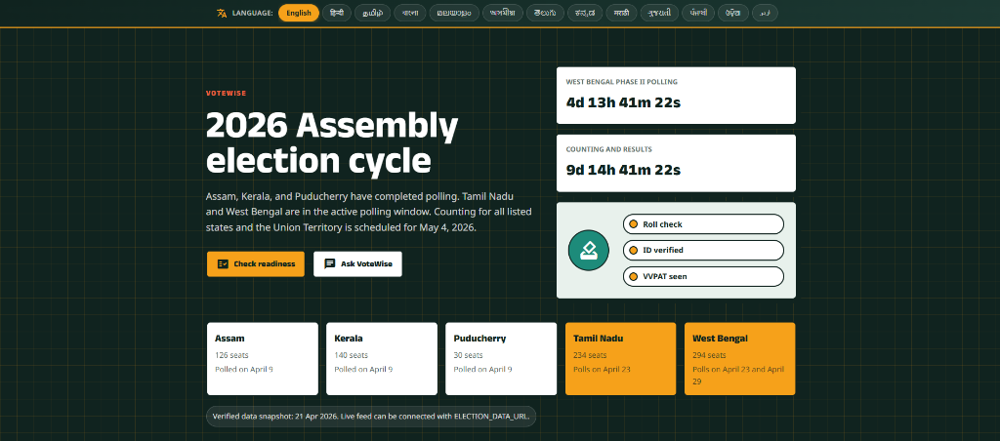

# VoteWise 🗳️

[](https://votewise-197581117874.us-central1.run.app)
[](#)
[](#)

> **VoteWise** is a resilient, data-driven election assistant built for Prompt Wars 2026 Challenge 2. 

It transforms dense government PDFs into an interactive, personalized experience, helping Indian voters navigate election timelines, voter-roll checks, forms, and polling-day steps with zero friction.

---
**[🚀 Try the Live Demo on Cloud Run](https://votewise-197581117874.us-central1.run.app)**
---

<!-- 📸 Screenshot -->
<p align="center">
  
</p>

## 📖 Table of Contents
- [🎯 Chosen Vertical](#-chosen-vertical)
- [🧠 Approach & Logic](#-approach--logic)
- [⚙️ How the Solution Works](#️-how-the-solution-works)
- [🤔 Assumptions Made](#-assumptions-made)
- [✨ Key Features](#-key-features)
- [🏗️ Architecture & Security](#️-architecture--security)
- [♿ Accessibility (a11y)](#-accessibility-a11y)
- [🚀 Quick Start (Local & Docker)](#-quick-start-local--docker)
- [🧪 Testing Strategy](#-testing-strategy)
- [📂 Project Structure](#-project-structure)

## 🎯 Chosen Vertical
**Civic Technology & Voter Education**  
VoteWise is designed for the Indian electorate, focusing on voter education and civic engagement. It addresses the challenge of information asymmetry during elections by transforming dense, bureaucratic processes into accessible, interactive, and personalized guidance.

## 🧠 Approach & Logic
Our core engineering philosophy is **data-driven rendering with graceful degradation**, ensuring zero hallucinations for critical election facts.

1. **AI as a Facilitator, Not a Source**: Gemini is used to synthesize, contextualize, and translate information, while raw facts (dates, booth rules) are strictly sourced from official ECI data.
2. **The 3-Tier Data Strategy**:
   - **Tier 1 (Live)**: Real-time election status via Gemini + Google Search Grounding.
   - **Tier 2 (Remote)**: Dynamic updates via a browser-fetchable `election-data.json`.
   - **Tier 3 (Local Fallback)**: A curated, zero-latency local dataset guaranteeing offline-capable fallback.
3. **Strict Validation**: AI outputs (like Quiz generation) are forced into strict JSON schemas and validated client-side before rendering. Malformed AI output is rejected, never displayed.

## ⚙️ How the Solution Works
VoteWise provides a frictionless, step-by-step journey for the user:
1. **Pulse Check**: On load, the app fetches real-time election news using Search Grounding.
2. **Readiness Evaluation**: The user inputs basic details (age, registration status), and the "Am I ready?" engine branches into specific, actionable guidance (e.g., "Fill Form 6").
3. **Timeline Navigation**: Users follow a curated 10-step journey from registration to polling day.
4. **Locate & Learn**: The Polling Booth Simulator uses Google Maps to find nearby booths, while the Quiz Engine tests their knowledge.
5. **Contextual Chat**: At any point, users can ask the neutral Civic Assistant for help, with rate-limiting and local fallbacks ensuring stability.

## 🤔 Assumptions Made
- **Neutrality**: The app assumes a strictly non-partisan stance; it does not recommend candidates or ideologies.
- **Connectivity**: While fallback mechanisms exist, the primary AI chat and live pulse features assume an active internet connection.
- **Data Availability**: The application relies on the Election Commission of India (ECI) maintaining consistent guidelines and forms (like Form 6 for new voters).
- **Modern Browsers**: Assumes users are on modern, ES6-compliant browsers. A `<noscript>` fallback is provided for legacy environments.

## ✨ Key Features
- 🟢 **Live Election Pulse**: Real-time status via Gemini + Google Search Grounding.
- 🛤️ **Personalized "Am I ready?" Checker**: Branch-specific guidance based on user inputs.
- 📜 **10-Step Journey**: A curated election timeline with official ECI source backing.
- 📍 **Polling Booth Simulator**: Location-aware booth finder integrated with Google Maps.
- 💬 **Neutral Civic Assistant**: Gemini-powered chat with strict rate-limiting and local fallbacks.
- 🧠 **Dynamic Quiz Engine**: Gemini-generated quizzes with strict JSON schema validation.
- 🌐 **Hyper-Local & Multilingual**: 13-language support via Google Translate.

## 🏗️ Architecture & Security
VoteWise is hardened for production and complies with strict engineering standards:

### Google Cloud Workflow
- **Cloud Run** serves the production Vite build through hardened Nginx.
- **Cloud Functions** can proxy Gemini requests so the production API key stays server-side.
- **BigQuery** can capture anonymized AI-request telemetry for reliability analysis without storing prompts or user messages.
- **Cloud Storage** can host the public `election-data.json` feed consumed by `ELECTION_DATA_URL`.
- **Gemini API + Google Search grounding** power chat, quiz generation, and the live election pulse.
- **Google Maps Embed, Google Translate, Google Fonts, and Material Icons** support booth context, multilingual access, typography, and UI clarity.

### Runtime Configuration Injection
Runtime values are **never baked into the static build**.
- The Docker container uses an `entrypoint.sh` script to inject browser-safe environment variables (`GEMINI_PROXY_URL`, `GEMINI_MODEL`, `ELECTION_DATA_URL`, `GOOGLE_MAPS_KEY`, `ENABLE_SEARCH_GROUNDING`) into `window.APP_CONFIG`.
- Production deployments should use the included Cloud Function proxy (`functions/gemini-proxy`) and store `GEMINI_API_KEY` in Secret Manager or function environment variables.
- The frontend never receives `GEMINI_API_KEY`; all Gemini requests go through `GEMINI_PROXY_URL`.
- This allows the exact same Docker image to be promoted across environments while following 12-factor app principles.

### Defense-in-Depth Protections
- **Strict Content Security Policy (CSP)**: Restricts scripts, styles, and connections to known Google origins.
- **XSS Prevention**: All user and AI text is rendered via `textContent`. `innerHTML` is strictly prohibited. (Verified via `dom.test.js`).
- **Nginx Hardening**: Production containers serve with `X-Frame-Options`, `X-Content-Type-Options`, and `Referrer-Policy` headers.
- **Input Validation**: Client-side regex (`/^[A-Z]{3}\d{7}$/`) validates EPIC formats before API submission.
- **Rate Limiting & Token Capping**: A sliding window history cap (20 messages) and a 3-second cooldown protect the Gemini API quota.

## ♿ Accessibility (a11y)
Built to be usable by everyone:
- **Screen Reader Optimized**: `aria-live` regions for dynamic content, semantic HTML5, and `.sr-only` labels.
- **Keyboard Navigation**: Skip-to-content links and custom `:focus-visible` outlines.
- **No-JS Fallback**: A `<noscript>` tag redirects directly to the official ECI portal.
- **Motion Safe**: Honors `@media (prefers-reduced-motion: reduce)`.

## 🚀 Quick Start (Local & Docker)

### Prerequisites
- Node.js 18+
- Docker (for production builds)
- Gemini API Key

### Local Development
```bash
npm install
cp .env.example .env
# Edit .env with GEMINI_PROXY_URL for the frontend.
# Use GEMINI_API_KEY only for the Cloud Function proxy runtime.
npm run dev
```

### Production Docker Deployment
To build and run the secure production container locally:
```bash
docker build -t votewise .
docker run -p 8080:80 \
  -e GEMINI_PROXY_URL="https://YOUR_FUNCTION_URL" \
  -e GEMINI_MODEL="gemini-2.5-flash" \
  -e ELECTION_DATA_URL="https://storage.googleapis.com/YOUR_BUCKET/election-data.json" \
  -e GOOGLE_MAPS_KEY="your_maps_embed_key" \
  -e ENABLE_SEARCH_GROUNDING="true" \
  votewise
```

To deploy directly to Google Cloud Run with the optional Cloud Function proxy:
```bash
gcloud config set project utility-ridge-494115-u8

gcloud run deploy votewise \
  --source . \
  --region us-central1 \
  --allow-unauthenticated \
  --set-env-vars="GEMINI_PROXY_URL=https://YOUR_FUNCTION_URL,GEMINI_MODEL=gemini-2.5-flash,ELECTION_DATA_URL=https://storage.googleapis.com/YOUR_BUCKET/election-data.json,GOOGLE_MAPS_KEY=YOUR_MAPS_EMBED_KEY,ENABLE_SEARCH_GROUNDING=true"
```

See [`docs/google-cloud-workflow.md`](docs/google-cloud-workflow.md) and [`functions/gemini-proxy`](functions/gemini-proxy) for the Cloud Functions + BigQuery production path.

## 🧪 Testing Strategy
VoteWise is backed by 49+ unit tests across 10 suites using Vitest.

```bash
npm test        # Run the test suite
npm run build   # Build production bundle (~22 kB gzipped)
```
**Test Coverage Includes:**
- XSS injection prevention (`dom.test.js`)
- Production env isolation (`production-env.test.js`)
- AI output schema validation (`quiz.test.js`)
- Live data merge immutability (`liveData.test.js`)
- Voter readiness decision branching (`readiness.test.js`)

## 📂 Project Structure
```text
VoteWise/
  index.html              # SPA shell with CSP, noscript, config placeholders
  Dockerfile              # Multi-stage production build (Node + Nginx)
  entrypoint.sh           # Runtime secret injection script
  nginx.conf              # Hardened Nginx configuration
  docs/
    google-cloud-workflow.md
  functions/
    gemini-proxy/         # Optional Cloud Functions Gemini proxy + BigQuery logging
  public/
    election-data.json    # Browser-fetchable election feed
  src/
    config/constants.js   # Prioritizes window.APP_CONFIG over import.meta.env
    data/electionData.js  # Curated fallback election dataset
    main.js               # Entry point with error boundaries
    modules/              # Feature modules (chat, quiz, timeline, etc.)
  tests/                  # Vitest unit tests (10 suites)
```

---
*Verified data snapshot: April 2026. This app does not recommend parties, candidates, or ideologies. It provides neutral process guidance only.*
